# 유니티 엔진으로 SONIC X SHADOW GENERATIONS 연출을 구현해보자

## 개요 및 목표
소닉 시리즈의 **SONIC X SHADOW GENERTAIONS**에서 모방해보고 싶은 연출이 여럿 등장하여, 따라하고 싶은 생각이 들게 되었습니다.

게임 중 스테이지 곳곳에서 **Dooms Zone**이라는 구역을 돌파하게 되는데, **인셉션**과 **닥터 스트레인지**를 연상케 하는 기하학적인 연출을 보여줍니다. 

그러므로 Dooms Zone의 **세 가지 연출**을 **유니티 엔진**을 이용하여 구현해보고자 합니다.

현재 구현 방법 및 최적화를 본 Readme 페이지에 작성하고 있습니다.

구현된 셰이더는 **Built-in** 환경에서 작성되었습니다.

Universal Render Pipeline을 사용하는 프로젝트는 추후 추가할 예정입니다.

## 구현한 연출
- Reconstruction Object
- Bending Building
- Fractal Object

## Reconstruction Visual Effect

### 원본

...

### 구현 결과
[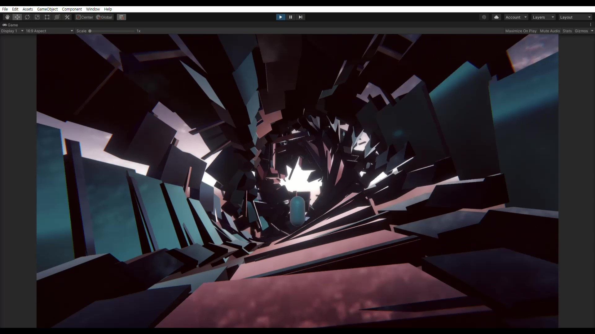](https://youtu.be/nQ6_T3U0jkU)
Dooms Zone 파트의 도입부의 연출을 구현해보았습니다.

### 구현 과정

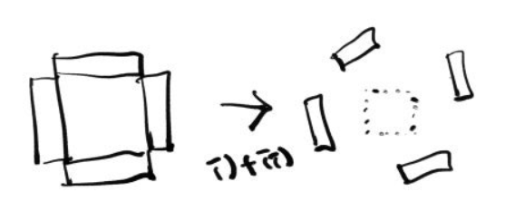

단순한 생각으로 접근하면, 

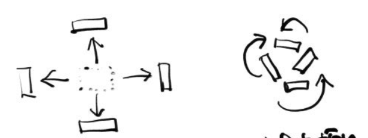

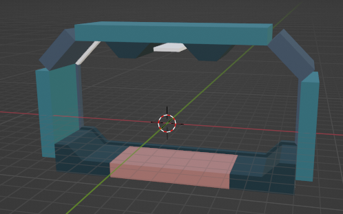

해당 씬에서 사용된 복도 블럭입니다.  
단일 모델이며, 여러 파츠로 구성되어 있습니다. (바닥, 천장, 벽면 ... 등)

 

복도 블럭 모델은 두 개의 UV 채널을 가집니다.
- UV1: 기본 알베도 텍스쳐 샘플링에 사용되는 UV 
- UV2: 연출 텍스쳐(Direction / ID) 샘플링에 사용되는 UV

 

이어서 아래의 사진은 두 번째 UV를 이용하여 연출 텍스쳐를 입힌 모습입니다. 

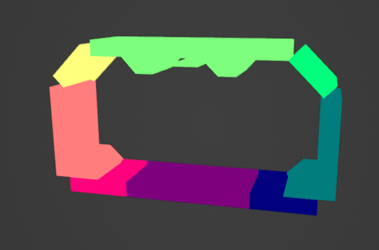

Direction 텍스쳐를 입힌 모습입니다.  
분해될 때의 방향을 결정하기 위해 사용됩니다.   
방향의 기준은 Object 공간입니다.  
Direction의 RGB 수치는 방향 벡터의 XYZ에 대응되며, 반대 방향을 고려하여 0.5를 원점으로 합니다.   

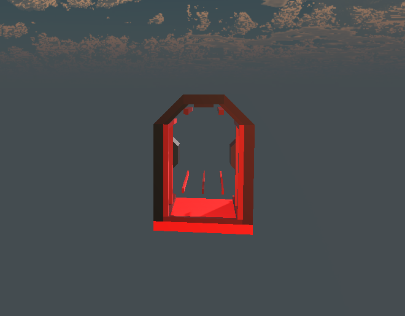

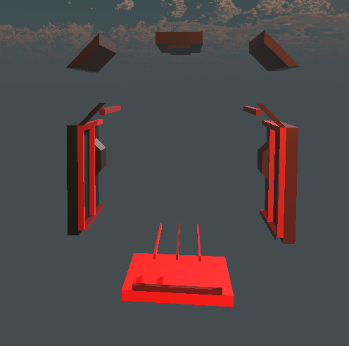

Direction 텍스쳐를 이용하여, 파츠를 분해한 모습입니다.  
 
(위의 복도 블럭과 다른 모델이지만, 설명하기에 크게 문제없습니다.)   

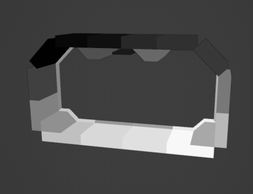

ID 텍스쳐를 입힌 모습입니다.  
하나의 모델로 구성된 여러 파츠를 구분하기 위해 사용됩니다.   

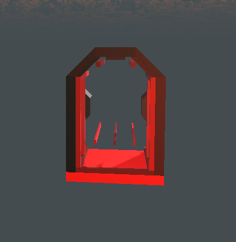
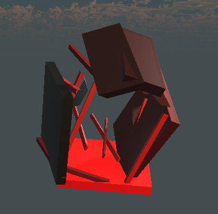

ID 텍스쳐를 이용하여, 파츠를 회전시킨 모습입니다.   
셰이더 내부에서 직접 만든 랜덤 함수와 샘플링한 ID 값을 이용하여, 각 파츠별로 구성된 Vertex끼리 일관된 회전을 보이도록 합니다.   

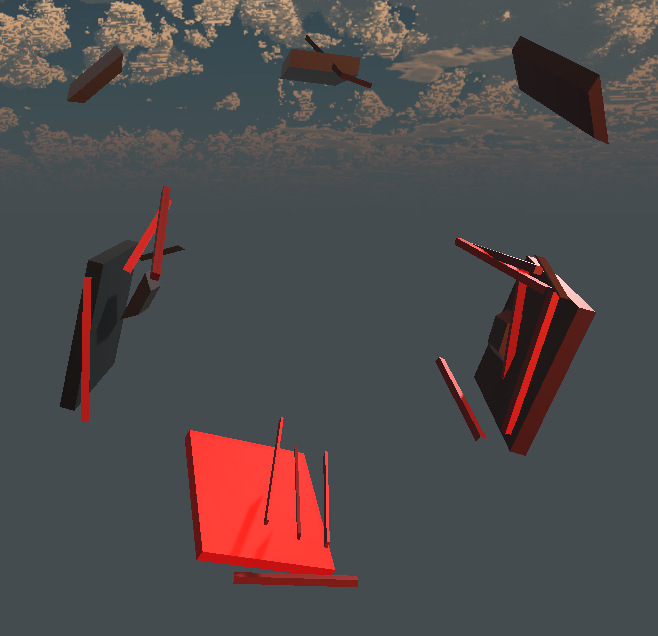

위의 두 연산을 함께 나타낸 모습입니다.   
회전의 중심이 너무나 커지는 것을 방지하기 위해, 파츠의 회전 다음 분해 순으로 계산됩니다.   

### 최적화
씬에서는 50개의 복도 블럭이 배치되어 있습니다.  
그리고 이를 관리하는 매니저 컴포넌트가 존재합니다   

첫 구현 당시에는, 매니저 스크립트에서 각 블럭마다 머테리얼을 복제하도록 만들었습니다.  
그리고 코루틴과 Animation Curve를 이용하여 타이밍에 맞춰 분해하는 연출을 수행합니다.  
이 부분은 각 머테리얼마다의 SetFloat()를 이용하여 Property(진행 정도)를 조정을 통해 이루어집니다.    

위 구조의 문제점은 머테리얼의 복제입니다.   

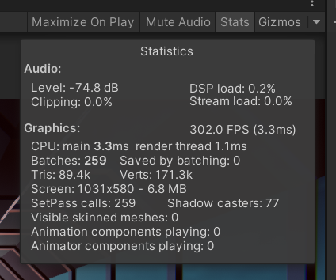

- Batches는 카메라 뷰에서 렌더링을 수행할 오브젝트의 개수를 의미합니다.   
- SetPass Calls는 Batches를 렌더링할 때의 RenderState의 변화 수를 의미합니다.  
오브젝트가 동일한 머테리얼을 사용하면 SetPass Calls은 줄어듭니다.   
- (일정 구간의 평균이 아닌) 매 프레임의 FPS는 무의미한 수치로 판단되니 무시합니다.   

외관상 같은 머테리얼이지만, 복제가 이루어지는 순간 RenderState 변화 수가 증가됩니다.  
그러므로 각 개수만큼 DrawCall이 발생하게 됩니다.  
씬의 라이트, 섀도우, GI... 등이 복합적으로 있는 경우, DrawCall은 더더욱 증가하게 됩니다.    

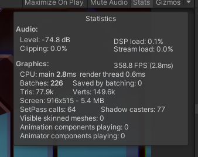

그러므로 머테리얼 복제를 수행하지 않는 구조로 수정하였습니다.  
단일의 머테리얼에서 Property(전체적인 진행 정도) 하나만 조정하도록 합니다.  
그리고 오브젝트 마다의 월드 공간 Z 값을 이용하여 비교를 수행합니다.  
이렇게 하면, 같은 머테리얼을 이용해서도 오브젝트마다 다른 모습을 보일 수 있습니다.    

이의 결과로 SetPass Calls가 줄어든 것을 확인했습니다.   

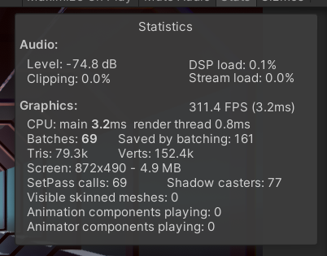

또 GPU Instancing을 통해, Batches의 개수를 더욱 줄였습니다.   

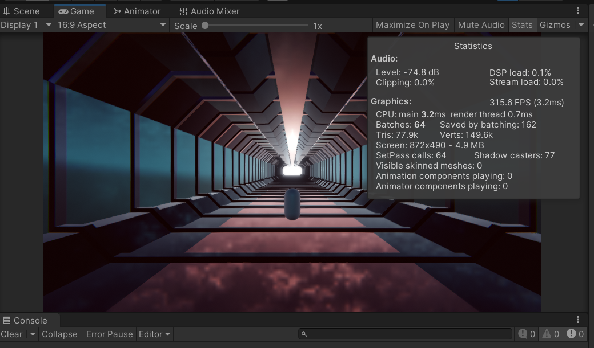
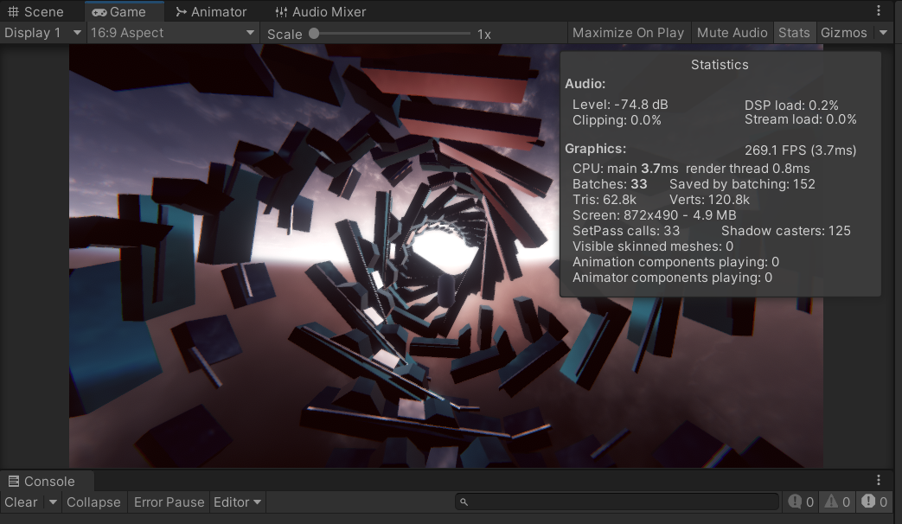

최적화 후의 게임 뷰 모습입니다.   

## Bending Building
[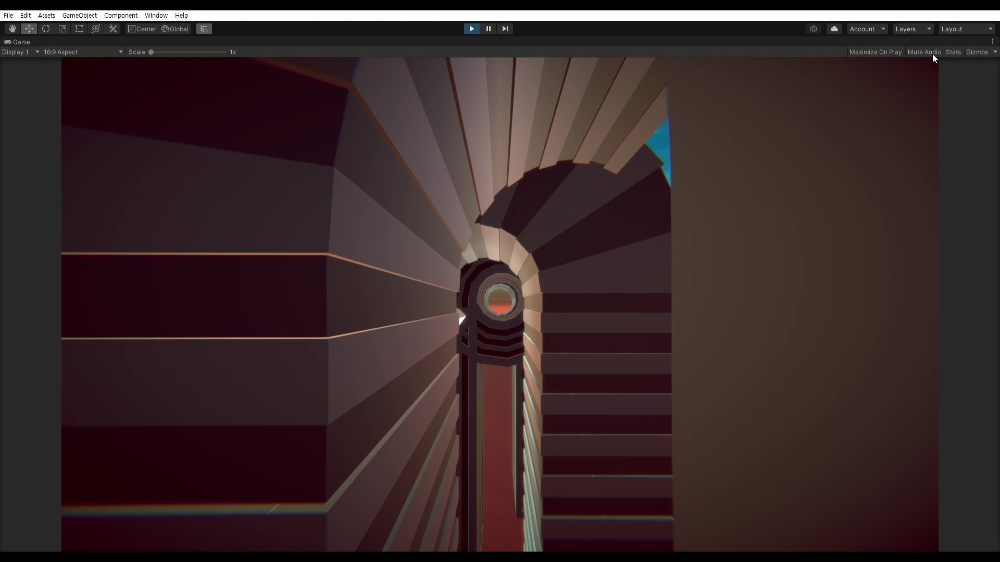](https://youtu.be/7rDaIqZ2_Vo)
Sunset Height 스테이지의 Dooms Zone에 등장하는 연출을 구현해보았습니다.

### 구현

## Fractal Visual Effect
[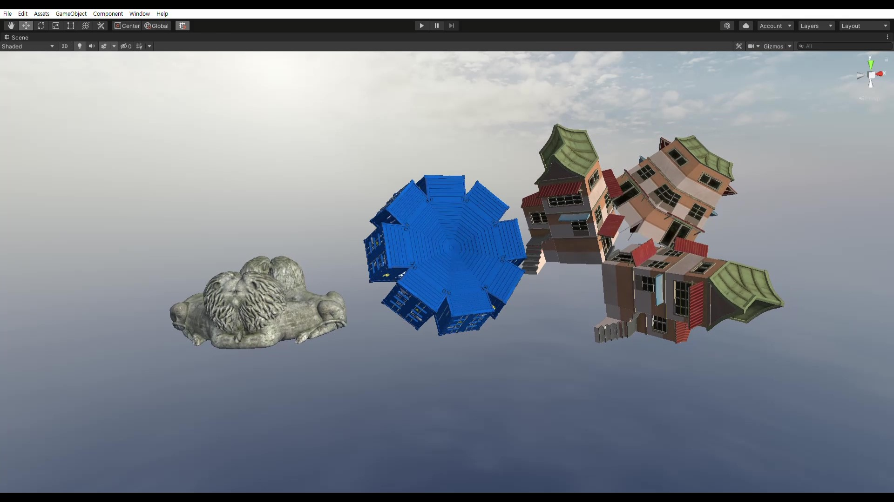](https://youtu.be/dzbckMUbfpY)
Dooms Zone 파트의 장식으로 사용된 프렉탈 효과를 구현해보았습니다.

### 구현

## 후기

GPT가 추천해 준 단어이지만... 지금 보면 **Reconstruction**보단 **Broken**이라는 단어가 더 어울리는 것 같습니다.  
 

## 참고한 자료
- SONIC X SHADOW GENERATIONS
- 유니티 그래픽스 최척화 스타트업
- 아티스트를 위한 유니티 URP 셰이더 입문 (URP 프로젝트 한정)